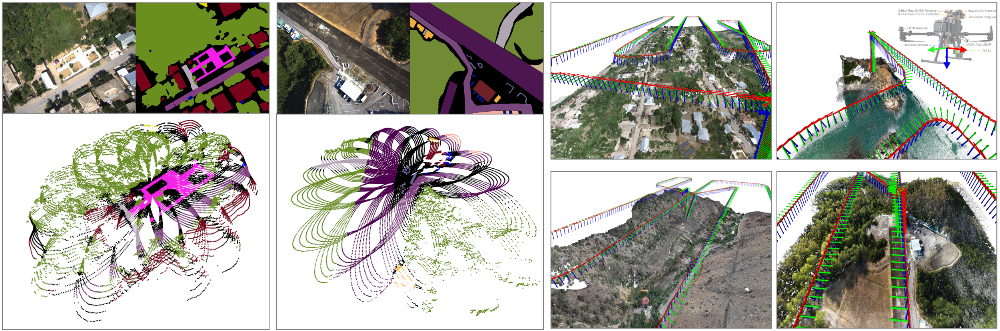
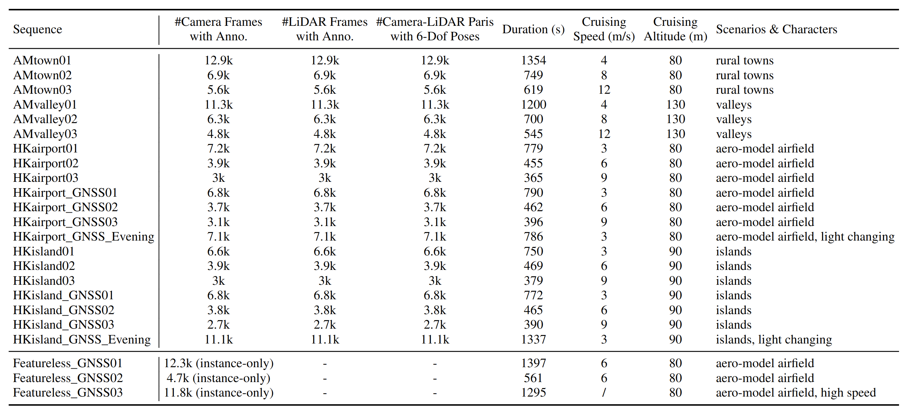
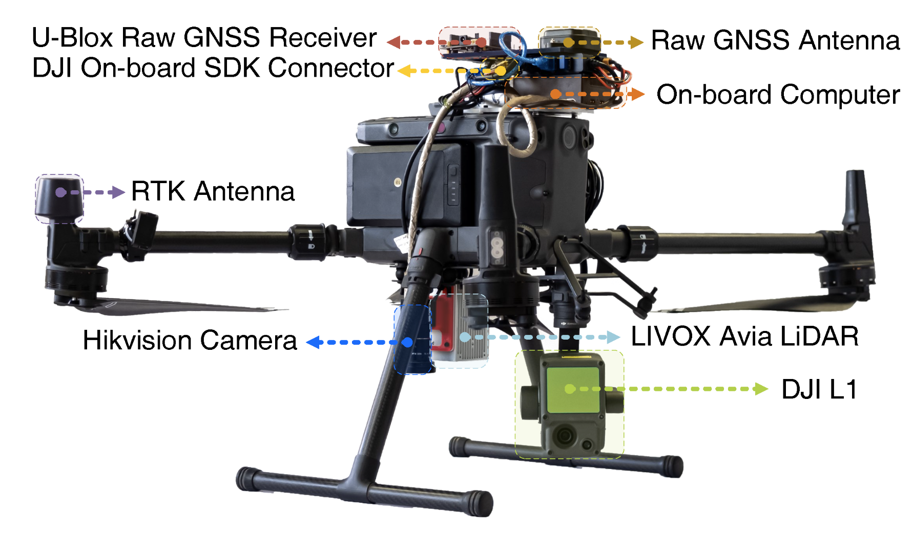

# UAVScenes 
We introduce UAVScenes, a large-scale dataset designed to benchmark various tasks across both 2D and 3D modalities.
Our benchmark dataset is built upon the well-calibrated multi-modal UAV dataset MARS-LVIG, originally developed only for simultaneous localization and mapping (SLAM). We enhance this dataset by providing manually labeled semantic annotations for both images and LiDAR point clouds, along with accurate 6-degree-of-freedom (6-DoF) poses. These additions enable a wide range of UAV perception tasks, including detection, segmentation, depth estimation, 6-DoF localization, place recognition, and novel view synthesis (NVS). To the best of our knowledge, this is the first UAV benchmark dataset to offer both image and LiDAR point cloud semantic annotations (120k labeled pairs), with the potential to advance multi-modal UAV perception research significantly. 



## Dataset Overview

- Summary

The summary of the full UAVScenes dataset is listed as follows, where a total of 23 sequences are included. Among them, 20 sequences are with camera-LiDAR semantic annotations and 6-DoF poses, while the rest 3 sequnces are with 2D dynamic object annotations only.



- Download Link

Due to the large space of the full UAVScenes dataset, we provide a 5x downsampled version in the supplement. We include camera images, LiDAR point clouds, annotations, 6-DoF poses, reconstructed 3D maps (point cloud + mesh).
The 5x-downsampled dataset can be downloaded at 
anoymous site [Download_Link](https://suppsupp321-my.sharepoint.com/:f:/g/personal/suppsupp321_suppsupp321_onmicrosoft_com/EseMuoSqW9lMj2lbH2OEl9MBbeuj5D-XUy6IJSxlps-aVQ?e=ZHazLK)


- Directory Structure

After downloading, you need to unzip the downloaded files, where all compressed files are in `.zip` formats.

1. `interval5_2Dsemantic_instance` include 2D semantic annotations in `uint8` RGB colors or class ids.
```
- interval5_2Dsemantic_instance
    - skip300_AMtown01_interval5
        - semantic_and_instance_color_images_interval5
            - 1658137057.641204937.png
            - 1658137058.142927663.png
...
```

2. `interval5_3Dsemantic` include 3D LiDAR point cloud annotations in `uint8` RGB colors or class ids. Note that `lidar` is the lidar timestamp, while `image` is the corresponding image timestamp. 
```
- interval5_3Dsemantic
    - skip300_AMtown01_interval5
        - images_filtered_interval5_livoxlidar_filtered_labelids
            - image1658137057.641204937_lidar1658137057.624840774.txt
            - image1658137058.142927663_lidar1658137058.124909215.txt
```

3. `interval5_nolabels` mainly include images, LiDAR point clouds, depth maps, 6-DoF poses, GNSS coordinates from RTK.
```
- interval5_nolabels
    - skip300_AMtown01_interval5
        - images_filtered_interval5
            - 1658137057.641204937.jpg
        - images_filtered_interval5_livoxlidar_16bit200
            - ...
        - images_filtered_interval5_livoxlidar_color
            - ...
        - images_filtered_interval5_livoxlidar_colorfusedimage
            - ...
        - images_filtered_interval5_livoxlidar_filtered
            - ...
        - posest_filtered_interval5_viz.png
        - rtk_positions.csv
        - rtk_positions_viz.png
        - sampleinfos_interpolated_filtered_interval5.json
```

4. `terra_3dmap_pointcloud_mesh` include the reconstructed 3D maps in both point cloud and mesh formats.
```
- terra_3dmap_pointcloud_mesh
    - AMtown
        - cloud_merged.ply
        - Mesh.ply
        - terra_ply
            - ...
```

5. `UAVScenesv2_SemanticKITTI_format` include the SemanticKITTI-style UAVScenes dataset.
```
- UAVScenesv2_SemanticKITTI_format
    - dataset 
        - sequences
            - skip300_AMtown01_interval5
                - labels
                    ...
                - velodyne
                    ...
                - velodyne_mean
                    ...
``` 

6. `interval1_dynamic_objects_Featureless_GNSS` include the dynamic object annotaions for the Featuresless_GNSS sequences.
```
- interval1_dynamic_objects_Featureless_GNSS
    - skip300_Featureless_GNSS01_interval1
        - images
            ...
        - instance_semantic_masks
            ...
```

## Baseline Codes
- We have provided the baseline codes for all 6 tasks, which are also uploaded at `supp_codes.zip` [Download_Link](https://suppsupp321-my.sharepoint.com/:f:/g/personal/suppsupp321_suppsupp321_onmicrosoft_com/EseMuoSqW9lMj2lbH2OEl9MBbeuj5D-XUy6IJSxlps-aVQ?e=ZHazLK)

- The detailed running instructions are in the respective readme files. 
    1. [2D Semantic Segmentation Documentation](./README1_2DSemantic.md)

    2. [3D Semantic Segmentation Documentation](./README2_3DSemantic.md)

    3. [Place Recognition Documentation](./README3_PlaceRecognition.md)

    4. [Novel View Synthesis Documentation](./README4_NovelViewSynthesis.md)

    5. [Scene Coordinate Regression Documentation](./README5_SceneCoordinateRegression.md)

    6. [Depth Estimation Documentation](./README6_DepthEstimation.md)


## Data Collection Platform

The data collected platform used by the original Mars-LVIG dataset is the DJI M300 RTK, which is mainly loaded with
- Hikvision CA-050-11UC (camera)
- Livox Avia (LiDAR)
- u-blox ZED-F9P (raw GNSS receiver)
- DJI-L1 (close-source LiDAR)


<!--  -->
